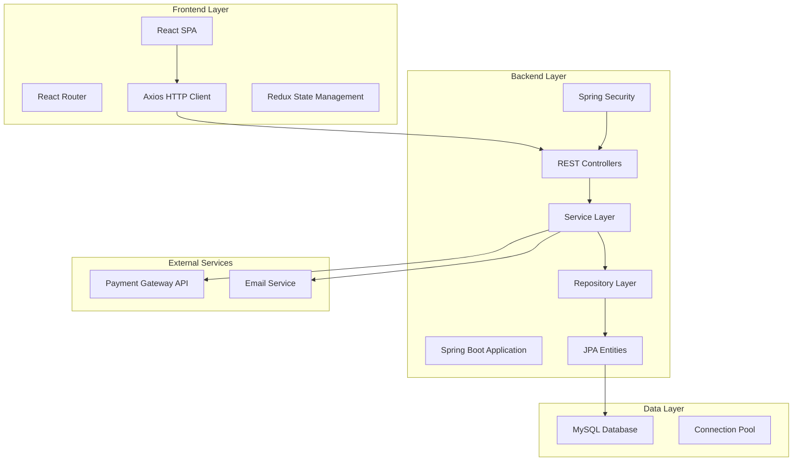
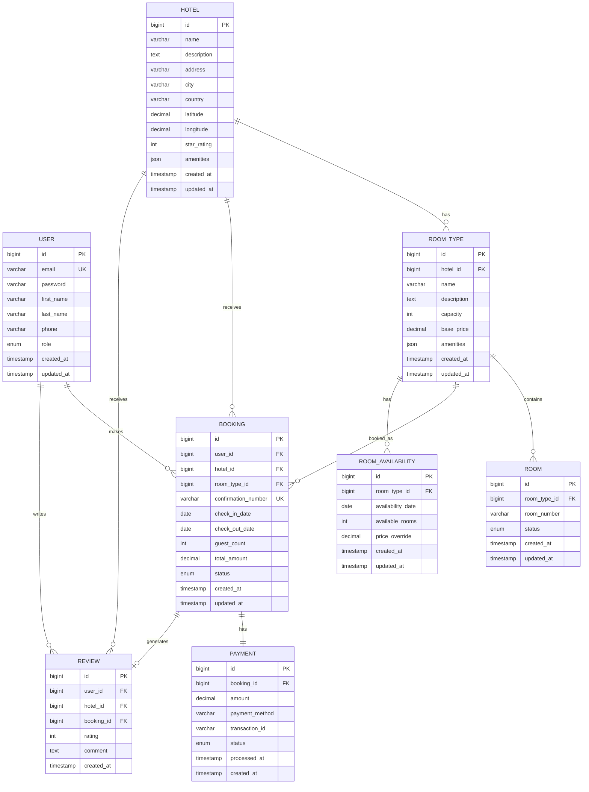

# Hotel Booking System Design Document

## Overview

The Hotel Booking System is a full-stack web application built with Java Spring Boot backend and React frontend. The system provides a comprehensive platform for hotel reservations, inventory management, and administrative operations. The architecture follows a layered approach with clear separation of concerns, RESTful API design, and secure authentication mechanisms.

## Architecture

### High-Level Architecture



### Technology Stack

**Frontend:**
- React 18 with functional components and hooks
- React Router for navigation
- Axios for HTTP requests
- Redux Toolkit for state management
- Material-UI for component library
- Formik for form handling and validation

**Backend:**
- Java 17
- Spring Boot 3.x
- Spring Security for authentication and authorization
- Spring Data JPA for data access
- Spring Web for REST API
- MySQL 8.0 for database
- Maven for dependency management

**Additional Tools:**
- JWT for stateless authentication
- BCrypt for password hashing
- Hibernate as JPA implementation
- Jackson for JSON serialization

## Components and Interfaces

### Frontend Components

#### Core Components
- **App Component**: Main application wrapper with routing
- **Header/Navigation**: User authentication status and navigation menu
- **Footer**: Static footer with links and information

#### Authentication Components
- **LoginForm**: User login interface
- **RegisterForm**: New user registration
- **ProtectedRoute**: Route wrapper for authenticated users

#### Hotel Search Components
- **SearchForm**: Location and date search interface
- **HotelList**: Display search results
- **HotelCard**: Individual hotel preview card
- **FilterPanel**: Search result filtering options

#### Hotel Details Components
- **HotelDetails**: Comprehensive hotel information display
- **RoomList**: Available room types and pricing
- **RoomCard**: Individual room information
- **ReviewSection**: Customer reviews and ratings

#### Booking Components
- **BookingForm**: Guest information and payment details
- **BookingConfirmation**: Booking success page
- **BookingHistory**: User's past and upcoming bookings
- **BookingDetails**: Individual booking information

#### Admin Components
- **AdminDashboard**: Hotel administrator overview
- **InventoryManagement**: Room availability and pricing
- **BookingManagement**: View and manage reservations
- **ReportsPanel**: Analytics and reporting interface

### Backend API Endpoints

#### Authentication Endpoints
```
POST /api/auth/register - User registration
POST /api/auth/login - User login
POST /api/auth/logout - User logout
GET /api/auth/profile - Get user profile
PUT /api/auth/profile - Update user profile
```

#### Hotel Search Endpoints
```
GET /api/hotels/search - Search hotels by criteria
GET /api/hotels/{id} - Get hotel details
GET /api/hotels/{id}/rooms - Get available rooms
GET /api/hotels/{id}/reviews - Get hotel reviews
```

#### Booking Endpoints
```
POST /api/bookings - Create new booking
GET /api/bookings - Get user bookings
GET /api/bookings/{id} - Get booking details
PUT /api/bookings/{id} - Update booking
DELETE /api/bookings/{id} - Cancel booking
```

#### Admin Endpoints
```
GET /api/admin/hotels/{id}/inventory - Get room inventory
PUT /api/admin/hotels/{id}/inventory - Update room availability
GET /api/admin/hotels/{id}/bookings - Get hotel bookings
GET /api/admin/reports - Get analytics reports
```

#### Payment Endpoints
```
POST /api/payments/process - Process payment
GET /api/payments/{id}/status - Get payment status
```

## Data Models

### Database Schema



### JPA Entity Classes

#### User Entity
```java
@Entity
@Table(name = "users")
public class User {
    @Id
    @GeneratedValue(strategy = GenerationType.IDENTITY)
    private Long id;
    
    @Column(unique = true, nullable = false)
    private String email;
    
    @Column(nullable = false)
    private String password;
    
    @Column(name = "first_name")
    private String firstName;
    
    @Column(name = "last_name")
    private String lastName;
    
    private String phone;
    
    @Enumerated(EnumType.STRING)
    private UserRole role;
    
    @CreationTimestamp
    @Column(name = "created_at")
    private LocalDateTime createdAt;
    
    @UpdateTimestamp
    @Column(name = "updated_at")
    private LocalDateTime updatedAt;
}
```

#### Hotel Entity
```java
@Entity
@Table(name = "hotels")
public class Hotel {
    @Id
    @GeneratedValue(strategy = GenerationType.IDENTITY)
    private Long id;
    
    @Column(nullable = false)
    private String name;
    
    @Column(columnDefinition = "TEXT")
    private String description;
    
    private String address;
    private String city;
    private String country;
    private BigDecimal latitude;
    private BigDecimal longitude;
    
    @Column(name = "star_rating")
    private Integer starRating;
    
    @Column(columnDefinition = "JSON")
    private String amenities;
    
    @OneToMany(mappedBy = "hotel", cascade = CascadeType.ALL)
    private List<RoomType> roomTypes;
    
    @CreationTimestamp
    @Column(name = "created_at")
    private LocalDateTime createdAt;
    
    @UpdateTimestamp
    @Column(name = "updated_at")
    private LocalDateTime updatedAt;
}
```

## Error Handling

### Frontend Error Handling
- **Global Error Boundary**: Catch and display React component errors
- **API Error Interceptor**: Handle HTTP errors and display user-friendly messages
- **Form Validation**: Real-time validation with error messages
- **Network Error Handling**: Offline detection and retry mechanisms

### Backend Error Handling
- **Global Exception Handler**: Centralized error handling with @ControllerAdvice
- **Custom Exception Classes**: Business logic specific exceptions
- **Validation Errors**: Bean validation with detailed error messages
- **Security Exceptions**: Authentication and authorization error handling

### Error Response Format
```json
{
    "timestamp": "2024-01-15T10:30:00Z",
    "status": 400,
    "error": "Bad Request",
    "message": "Validation failed",
    "path": "/api/bookings",
    "details": [
        {
            "field": "checkInDate",
            "message": "Check-in date cannot be in the past"
        }
    ]
}
```

## Testing Strategy

### Frontend Testing
- **Unit Tests**: Jest and React Testing Library for component testing
- **Integration Tests**: Test component interactions and API calls
- **E2E Tests**: Cypress for critical user journeys
- **Accessibility Tests**: Automated accessibility testing with axe-core

### Backend Testing
- **Unit Tests**: JUnit 5 for service and utility classes
- **Integration Tests**: Spring Boot Test for repository and API testing
- **Security Tests**: Test authentication and authorization
- **Database Tests**: TestContainers for database integration testing

### Test Coverage Goals
- Minimum 80% code coverage for backend services
- Critical path testing for all user journeys
- API contract testing for all endpoints
- Database constraint and validation testing

## Security Considerations

### Authentication & Authorization
- JWT-based stateless authentication
- Role-based access control (Customer, Hotel Admin, System Admin)
- Password hashing with BCrypt
- Session timeout and token refresh

### Data Protection
- HTTPS enforcement for all communications
- SQL injection prevention with parameterized queries
- XSS protection with input sanitization
- CSRF protection with Spring Security

### API Security
- Rate limiting to prevent abuse
- Input validation and sanitization
- Secure headers configuration
- API versioning for backward compatibility

## Performance Optimization

### Frontend Performance
- Code splitting and lazy loading
- Image optimization and lazy loading
- Caching strategies for API responses
- Bundle size optimization

### Backend Performance
- Database connection pooling
- Query optimization and indexing
- Caching with Redis for frequently accessed data
- Pagination for large result sets

### Database Optimization
- Proper indexing on search and join columns
- Query optimization and execution plan analysis
- Database connection pooling
- Read replicas for reporting queries